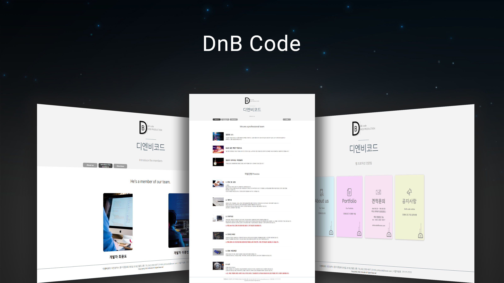

DnB Code

  

주제 : 디엔비코드(가상 웹 페이지 제작업체)페이지

개요 : 디엔비코드라는 웹페이지 제작업체를 설립했다는 컨셉으로 진행한 프로젝트 입니다.

- 프로젝트 기간 : 2주
- 프로젝트 인원 : 2명(프론트 1, 백엔드 1)
- 사용 기술 : Html, css, JavaScript, Node.js
- 담당 업무 : 데이터베이스 연동, 에러코드 및 오류 수정작업
- 세부 업무 : 데이터베이스 연동,문의글 작성 및 관리자 페이지에서 문의 전체글 확인기능

- 느낀점 : 
    - 배우지 않았던 node.js 를 활용하여 DB 연동을 하게되었고 이를 성공하면서 큰 성취감을 느꼈습니다.
    - 정확한 정보전달의 중요성, clean code의 중요성을 느꼈습니다.

- 보완점 :
    - node.js로 CRUD를 하면서 시간을 많이 잡아먹게되었고 초반 진행하려했던 로그인기능을 추가하지못한 아쉬움. 
