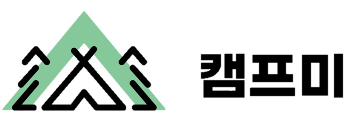

# Camp Me 🚎

  

- 주제 : 캠핑장 정보공유 및 소통 커뮤니티 
- 개요 : 차량관제 프로젝트는 차량을 수기로 관리하는 업체를 대상으로 만든 프로젝트 입니다.
- 프로젝트 기간 : 3주
- 프로젝트 인원 : 3명(프론트 2, 백엔드 1)
- 사용 기술 : React.js, Spring Boot, JPA, MySQL, Git, AWS
- 담당 업무 : ''
- 세부 업무 : ''

- 느낀점 : 
    - git으로 프로젝트를 관리하며 개인프로젝트때 느끼지 못한 commit 충돌 이슈와 팀원간 소통 중요성을 느꼈습니다.
    - 정확한 정보전달의 중요성과 clean code의 중요성을 느꼈습니다.
    - 글쓰기페이지 부분에서 Editor를 사용할 때 사진파일을 불러오는 부분에서 오류가 많이 생겨 시간이 오래걸렸는데, 좀 더 자세히 알아보고 사용했더라면 하는 아쉬움이 있었습니다.

- 보완점 :
    - Redux를 사용하지 못해 회원가입, 로그인을 포함한 모든 정보를 Props 또는 local storage에 영구 저장하여 무조건
      로그아웃 (window.localStorage.clear();) 코드로 지워줘야하는 이슈. 
    - Code를 좀 더 Clean하게 작성하지 못한 아쉬움.
